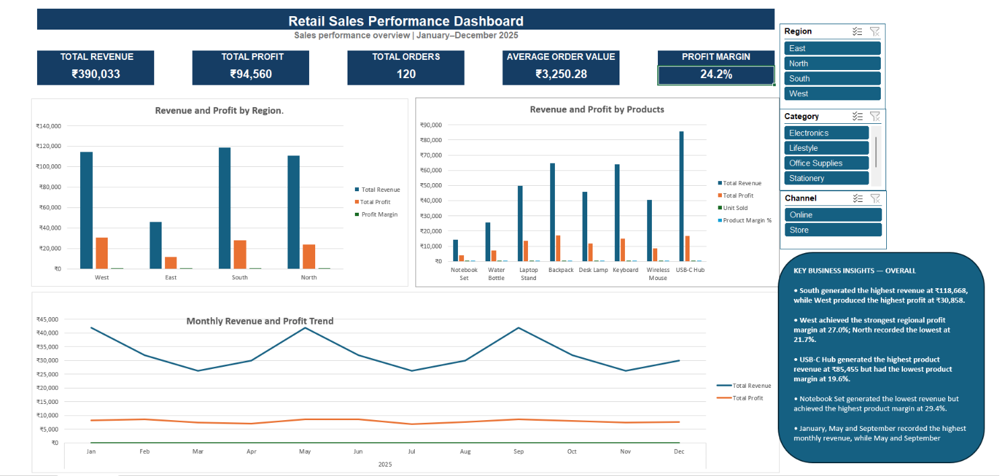

Retail Sales Analysis - Excel Dashboard

Project Overview
This project analyses retail sales performance using Microsoft Excel. It covers the complete analytical workflow: cleaning raw transactional data, calculating business KPIs, creating PivotTables and PivotCharts, identifying actionable insights, and building an interactive dashboard with slicers.
The dashboard allows users to filter performance by Region, Category, and Channel. All KPI cards and charts update dynamically based on the selected filters.
Business Questions
The analysis answers the following questions:
Which region generates the highest revenue and profit?
Which products perform best by revenue, profit, and profit margin?
Which months show the strongest and weakest sales performance?
Does higher revenue always result in higher profitability?
How do region, product category, and sales channel affect performance?
Dataset
The cleaned dataset contains 120 retail orders from January to December 2025.
Key fields include:
Order ID and Order Date
City and Region
Sales Channel
Product and Category
Quantity, Unit Price, and Discount
Revenue and Profit
Customer Rating
Data Cleaning
The following cleaning steps were completed:
Preserved the original raw-data worksheet
Standardised inconsistent Channel values
Identified and removed 2 duplicate records
Identified missing values using filters
Replaced the missing City with `Unknown`
Recovered the missing Category from matching Product records
Retained the missing Customer Rating as blank rather than assuming a value
Converted the cleaned range into a structured Excel Table
Key Performance Indicators
KPI	Overall Result
Total Revenue	₹390,033
Total Profit	₹94,560
Total Orders	120
Average Order Value	₹3,250.28
Profit Margin	24.2%
Key Insights
South generated the highest regional revenue at ₹118,668.
West generated the highest regional profit at ₹30,858 and achieved the strongest regional profit margin at 27.0%.
USB-C Hub generated the highest product revenue at ₹85,455, but it had the lowest product margin at 19.6%.
Notebook Set generated the lowest product revenue but achieved the highest product margin at 29.4%.
All eight products sold 45 units, showing that price and discount differences—not unit volume—drove the variation in revenue.
January, May, and September produced the highest monthly revenue. May and September generated the highest monthly profit.
Dashboard Features
Five dynamic KPI cards
Revenue and profit comparison by region
Product-performance analysis
Monthly revenue and profit trend
Interactive Region, Category, and Channel slicers
Dynamic calculations using `GETPIVOTDATA`
Business-insight summary
Excel Skills Demonstrated
Data cleaning and validation
Excel Tables
`SUM`, `COUNTA`, and `IFERROR`
PivotTables and PivotCharts
Calculated fields
Date grouping
Sorting and filtering
Slicers and report connections
Dynamic KPI calculations
Dashboard design and business storytelling
Repository Files
```text
retail-sales-analysis-excel/
├── Mahadev_Retail_Sales_Analysis.xlsx
├── dashboard_preview.png
└── README.md
```
How to Use the Workbook
Download Mahadev_Retail_Sales_Analysis.xlsx.
Open the file in Microsoft Excel.
Open the Dashboard worksheet.
Use the Region, Category, and Channel slicers to explore filtered performance.
Use the clear-filter button on each slicer to return to the overall view.
Author
Mahadev  
GitHub Profile
